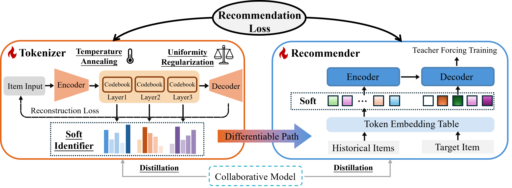

# UniGRec: Unified Generative Recommendation with Soft Identifiers for End-to-End Optimization

<a href="https://arxiv.org/abs/2601.17438"></a>

Official implementation of **UniGRec**.

- **Paper:** [UniGRec: Unified Generative Recommendation with Soft Identifiers for End-to-End Optimization](https://arxiv.org/abs/2601.17438)

---

## Introduction

Generative recommendation typically involves two components: a tokenizer that learns item identifiers and a recommender trained on them. Existing methods often decouple tokenization from recommendation or rely on asynchronous alternating optimization, limiting full end-to-end alignment.

UniGRec unifies the tokenizer and recommender under the ultimate recommendation objective via **differentiable soft item identifiers**, enabling joint end-to-end training. This introduces three challenges: **training–inference discrepancy** (soft-to-hard mismatch), **item identifier collapse** (codeword usage imbalance), and **collaborative signal deficiency** (overemphasis on token-level semantics).

UniGRec addresses them with:

- **Annealed Inference Alignment**
- **Codeword Uniformity Regularization**
- **Dual Collaborative Distillation**

---

## Framework



---

## Repository Structure

- `rqvae/`: RQVAE tokenizer (stage 1)
- `model/`: UniGRec model and end-to-end training (stage 2)
- `dataset/`: dataset preprocessing scripts
- `run_train_rqvae.sh`: stage 1 training script
- `run_train_unigrec.sh`: stage 2 joint training script

---

## Installation

### 1) Clone

```bash
git clone https://github.com/Jialei-03/UniGRec.git
cd UniGRec
```

### 2) Create environment

```bash
conda create -n unigrec python=3.10 -y
conda activate unigrec
pip install -r requirements.txt
```

---

## Data Preparation

This repo expects dataset files in `./dataset/<DATASET>/`.

### Data Source

- [Amazon Reviews](https://jmcauley.ucsd.edu/data/amazon/index_2014.html)

### Step 1) Build parquet data and item embeddings

Run the notebook:

- `dataset/process.ipynb`

Outputs:

- `train.parquet`, `valid.parquet`, `test.parquet`
- `item_emb_td.parquet`

### Step 2) Export SASRec CF embeddings

Run the script:

- `dataset/prepare_cf_emb_beauty.sh`

Outputs:

- `cf_emb_sasrec256.parquet`

Example (Beauty):

```
dataset/Beauty/
  train.parquet
  valid.parquet
  test.parquet
  item_emb_td.parquet
  cf_emb_sasrec256.parquet
```

---

## Training

### Stage 1: Train RQVAE tokenizer

```bash
bash run_train_rqvae.sh
```

After training, the script prints the path to the best checkpoint.

### Stage 2: End-to-end joint training

```bash
bash run_train_unigrec.sh
```

Training progress and evaluation metrics can be monitored in SwanLab.

---

## Citation

If you find this repository useful, please cite:

```bibtex
@misc{li2026unigrecunifiedgenerativerecommendation,
      title={UniGRec: Unified Generative Recommendation with Soft Identifiers for End-to-End Optimization}, 
      author={Jialei Li and Yang Zhang and Yimeng Bai and Shuai Zhu and Ziqi Xue and Xiaoyan Zhao and Dingxian Wang and Frank Yang and Andrew Rabinovich and Xiangnan He},
      year={2026},
      eprint={2601.17438},
      archivePrefix={arXiv},
      primaryClass={cs.IR},
      url={https://arxiv.org/abs/2601.17438}, 
}
```

---

## License

This project is released under the BSD 3-Clause License. See [LICENSE](LICENSE).
